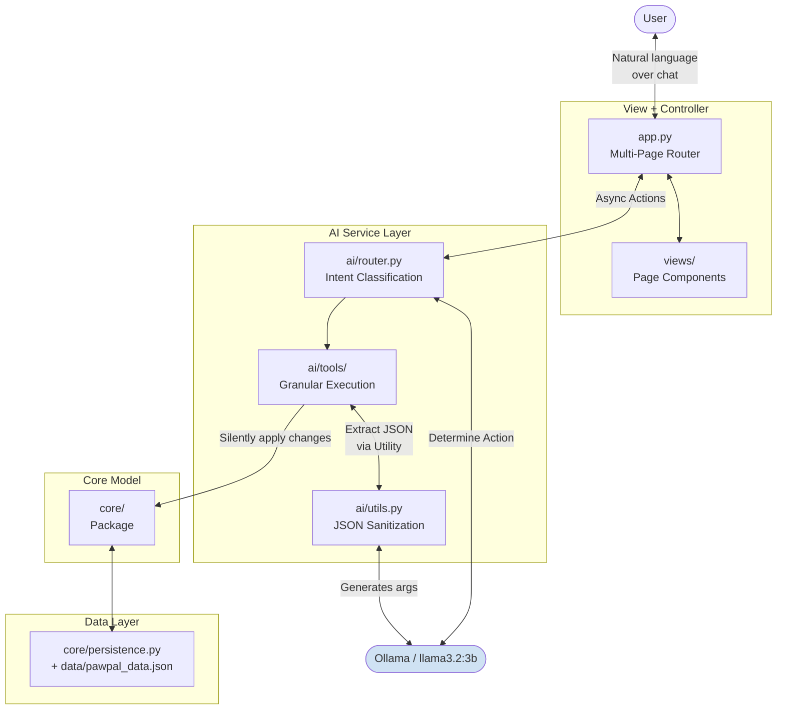
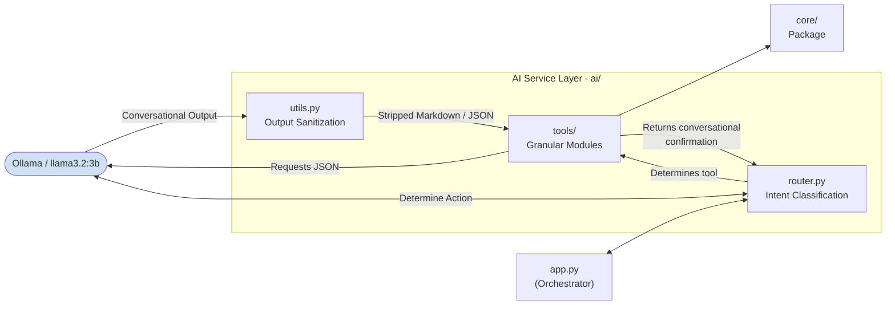
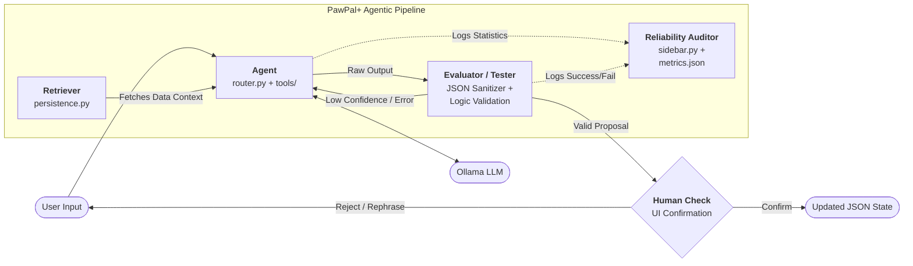

# PawPal+ (Module 2 Project)

PawPal+ is an AI-powered pet care assistant built with Python and Streamlit. It features a powerful **Hybrid UI**, maintaining standard dashboard controls while introducing a **Floating Conversational Hub**. This allows pet owners to manage tasks across multiple pets using native natural language at their convenience. It harnesses Dynamic Intent Routing and JSON sanitization for resilient actions. The AI layer runs entirely on a local Ollama model, such as `llama3.2:3b`, with no API key required.

## Features

- **Owner setup**: enter your name and daily time budget; fields lock after saving with an Edit button to unlock
- **Multi-pet support**: add any number of pets (name, species, age, and optional special needs); switch between pets to manage their tasks; each pet's special needs are summarized below the task table
- **Task manager**: add tasks with title, duration, priority, category, frequency, and scheduled time (15-minute step picker); tasks are only saved if no time conflict exists
- **Conflict detection**: Warns during task creation if another task overlaps within the same duration window across any pet. Uses interval-based logic rather than simple time-string matching.
- **Sort and filter**: sort tasks by scheduled time, priority, or duration; filter by priority; high-priority badge shows count of outstanding items
- **Complete / uncomplete**: toggle completion per task using an **Interactive Checkbox** within the data table; completing a daily or weekly task automatically queues the next occurrence; uncompleting removes it
- **Generate Plan**: filter by pet and status, schedule incomplete tasks within the time budget, display Scheduled / Could not fit / Complete tables. Features **Fully Reactive Rendering** where the plan automatically updates and persists throughout the session.
- **Data persistence**: all data saves to `data/pawpal_data.json` automatically on every change; restored on refresh or restart

## AI Features
- **Floating Conversational Hub**: Access the Llama AI instantly through a persistent action button. Optimized via direct `st.html` injection for zero latency and seamless visibility of your manual dashboard.
- **Dynamic Intent Routing**: The `router.py` parses user intent organically and routes it internally with multi-turn "Context Locking".
- **Smart Scheduler & Unified Status Report**: Proactively scans behavioral history to identify gaps and provides a warm, conversational narrative summary of both completed successes and missed routines. Uses an agentic multi-turn loop (up to 5 refinement turns) with confidence scoring (target 0.9+), strict HH:MM time validation, **non-zero duration enforcement (>=1m)**, per-pet baseline care enforcement (feeding + activity), same-category proximity checks, and daily time-budget awareness. **Enforces a strictly sequential Global Timeline**, ensuring tasks for different pets do not overlap if managed by a single caregiver. **Provides actionable guidance when the budget is full**, suggesting the user mark tasks as complete or increase the daily limit. Leads to a cohesive progress report that eliminates the need for separate analytics and alert tools.
- **Contextual Knowledge Base**: Seeded with industry-standard care (Dogs: 30m walk/2x feeding; Cats: play/grooming) to ground AI advice in best practices.
- **Conversational Pet Management**: Add, remove, or list pets using natural language. Features strict user-confirmation guardrails for any data-altering actions.
- **JSON Output Sanitization**: Integrated regex-based filtering strictly isolates python dictionaries from LLM conversational filler. Supports multiple nested blocks and malformed markdown resilience.
- **Automated Schema Validation**: Strict structural checks ensure AI-generated payloads contain all mandatory keys and non-null values before execution.
- **Content Guardrails**: Scans AI output for restricted keywords (e.g., medical advice, unauthorized diagnoses) to ensure advice is strictly grounded in pet care best practices.
- **Automated Reliability Auditing**: A dedicated persistence module tracks intent classification confidence, extraction accuracy, and agentic loop efficiency, providing real-time "Evaluation Metrics" on the system dashboard.

## Demo

### 1. Owner & Pet Setup


### 2. Task Manager


### 3. Task List


### 4. Generate Plan


## Architecture Overview

PawPal+ uses a lightweight layered architecture wrapped smoothly around a Unified Conversational UI.



| Layer | File(s) | Responsibility |
|-------|---------|---------------|
| Configuration | `config.py` | Centralized system instructions, pet care guidelines, and UI constants (emojis) |
| Layout Router | `app.py` | Streamlit entry point, `st.navigation` orchestration, and session state initialization |
| Page Components | `views/` package | Modular UI pages: Dashboard (Profile/Pets), Tasks, Planner, and AI Metrics |
| AI Service Layer | `ai/router.py`, `ai/tools/`, `ai/utils.py` | Intent parsing, zero-temperature grounding, tool interactions, and markdown sanitization |
| Core / Model | `core/` package (`models`, `scheduler`, `analytics`) | Data model, scheduler logic, and anomaly detection |
| Data Layer | `core/persistence.py`, `data/pawpal_data.json` | Automated JSON persistence and completion history |

The AI Service Layer gracefully restricts itself. When Ollama is disconnected, the system manages raw exceptions to prevent severe UI freezes.

### AI Service Layer



### UML Diagram


### System Organization

The system is designed as an agentic pipeline with automated validation and human-in-the-loop checkpoints.



| Component | Role | Logic |
|-----------|------|-------|
| **Retriever** | Data Fetching | Loads pet profiles, history, and schedule from `pawpal_data.json` into AI context. |
| **Agent** | Orchestration | Interprets intent and coordinates tool execution with the local LLM. |
| **Evaluator / Tester** | Self-Correction | Validates AI payloads for JSON integrity, scheduling conflicts, and care guidelines. |
| **Reliability Auditor** | **Evaluation & Metrics** | Quantifies AI performance by tracking confidence scores and multi-turn refinement efficiency. |
| **Human Check** | Decision Guard | Final verification step where the owner approves or rejects AI Proposals. |

## Setup Instructions

```bash
python -m venv .venv
source .venv/bin/activate  # Windows: .venv\Scripts\activate
pip install -r requirements.txt
ollama pull llama3.2:3b
ollama serve
streamlit run app.py
```

AI features require Ollama to be running. The app works without it but NL task creation, chat, alerts, and smart scheduling will fall back to manual/greedy behavior.

## Sample Interactions

| Feature | User Input | AI Output |
|---------|------------|-----------|
| **NL Task Creation** | "Schedule a 20min feeding for Mochi at 8am" | "Please verify this schedule: **Feeding** for **Mochi** at 08:00... Does this look accurate?" |
| **Manage Pets** | "Add a 2 year old cat named Snow" | "I've prepared the profile for **Snow**! ... Should I add them to your family?" |
| **List Pets** | "Which pets do I have?" | "Oh, I see that you have 2 dogs, **Pug** (1 year old) and **Mochi** (3 years old), and 1 cat, **Luna** (15 years old) with special needs of senior and arthritis..." |
| **Proactive Planner** | "What should I schedule?" | "Here is your smart plan: 10 task(s) for 3 pet(s)." grouped by pet with timeline (`08:00` - Morning Walk  30m) |
| **Packed Schedule** | "What should I schedule?" | "Your schedule is already packed for today! ... To add more tasks, please either mark some as 'Complete' or increase your daily time limit in the Dashboard." |
| **Unified Status Report** | "Check status" | "You've had a great start! Mochi completed feeding, but missed a walk. Let's get back on track by marking that complete." |
| **Escape Action** | "Nevermind" | *Breaks active intent lock and returns to main menu context.* |

## Design Decisions

| Decision | Choice | Pro | Con |
|----------|--------|-----|-----|
| LLM provider | Ollama local with `llama3.2:3b` | Highly capable, zero data sprawl, extremely flexible | Slower inference hardware demands |
| Central Configuration | `config.py` overrides `.env` | Eliminates extra dependencies/keys | Adjusting core configurations touches runtime variables |
| Missing Data Logic | Conversational AI interception | Prevents guessing or hard error locks | Requires an additional round trip to LLM |
| JSON Sanitization | Regular Expression Strippers | Highly resilient to varied LLM boilerplate | Complex formatting anomalies may occasionally penetrate |
| Schedule validation | Programmatic post-processing over prompt-only enforcement | Deterministic gap/budget/time checks regardless of LLM quality | Additional code complexity in validation loop |
| Testing AI components | Mock Router responses | Fast, repeatable, removes Ollama from standard test runner checks | Cannot emulate pure hallucination boundaries |

## 🧪 Testing and Reliability

PawPal+ maintains a high-integrity, regression-proof codebase with **>95% test coverage** across all AI and core modules.

- **Mocked AI Layers**: All Ollama interactions are mocked for deterministic testing.
- **Reliability Auditing**: Automated tracking of AI confidence, turn counts, and extraction success.
- **Agentic Validation**: Multi-turn self-correction loops for complex scheduling tasks are fully verified.

### Running Tests
```bash
python -m pytest --cov=ai --cov=core --cov-report=term-missing tests
```

Current Suite: **127 Tests Passed**  
265: Overall Coverage: **95%**

### Core System Tests
- **Data Integrity**: Verifies that task completion toggles correctly, pet additions scale properly, and primary keys (UUIDs) remain globally unique for accurate persistence.
- **Scheduling Logic**: Ensures budget-aware plan generation, interval-based conflict detection (identifying overlaps even between non-identical clock times), and idempotent recurrence (preventing duplicate tasks if completion is toggled multiple times).
- **Behavioral Analytics**: Validates anomaly detection for missed tasks, sliding-window history filters, and historical record removal upon "undoing" a completion.
- **Persistence Layer**: Confirms that the full state—including complex parent-child task linkages—survives JSON serialization and recovery across system restarts.

### AI Service Layer Tests
- **Intent Reliability**: Proves the system correctly routes diverse natural language queries to the proper internal tools, while maintaining strict context locks during multi-turn interactions and keyword-based escapes.
- **Agentic Refinement**: Verifies the 5-turn self-correction loop in the Smart Planner, ensuring the AI agent identifies its own scheduling errors and refines them until a high-confidence care plan is achieved.
- **Safety & Grounding**: Confirms that data-modifying actions (like removing a pet) trigger mandatory user-confirmation menus and that AI suggestions are strictly grounded in pet-specific care guidelines.
- **Payload Resiliency**: Tests the system's ability to extract structured data from "noisy" LLM output and handle malformed response formats using the hardened regex sanitizer.
- **Automated Validation**: Confirms that AI outputs are strictly checked against schemas and content guardrails (keyword scanning) before being processed by the application core.
- **Reliability Auditing**: Verifies the lifecycle of the `ReliabilityAuditor`, which quantifies system health by aggregating **Confidence Scores** (0.0 to 1.0) and success rates for the system evaluation dashboard.
- **Infrastructure**: Uses `unittest.mock` and a synchronized `SessionState` fixture in `conftest.py` to isolate tests from local Ollama and Streamlit states for deterministic execution.
- **Documentation Standard**: All **124 test cases** feature standardized header documentation for improved auditability.

### System Capabilities Summary
- **Proactive Anomaly Detection**: `AnalyticsEngine` identifies missed recurring tasks and triggers conversational alerts.
- **Batch Plan Execution**: The AI assistant processes multiple pet requirements simultaneously and applies updates via batch confirmation.
- **Human Evaluation**: Manually verified that "Smart Plan" suggestions respect species guidelines and historical patterns.

*Summary: A total of **127 out of 127 tests** are passing. The system maintains a **95% total coverage** floor, with 100% coverage on all core logic files.*

## Reflection

### Limitations and biases

- The NL task parser is only as good as the prompt. Unusual phrasing or ambiguous times may produce wrong field values.
- The predictive alert system flags patterns statistically. Special seasonal needs may trigger false missed-task alerts.
- Historical data reflects past owner behavior. The AI learn from user habits to suggest future "ideal" times.
- The system has no veterinary knowledge. It cannot determine if a medication schedule is medically appropriate.

### Misuse and prevention

- Primary risk is over-reliance: owners may treat AI health alerts as medical advice.
- Mitigation: every Proactive Alert instruction includes strict grounding in provided database facts only.

### Collaboration with AI

- **Helpful suggestion**: Using a multi-turn "Intent Lock" in the router significantly improved the reliability of follow-up corrections (e.g., "Change the time to 5pm").
- **Flawed suggestion**: Early attempts at alerts without "Zero-Temperature Grounding" led to hallucinations of fake pets like "Bella". Fixed via strict pet-list filtering and 0.0 temperature.
