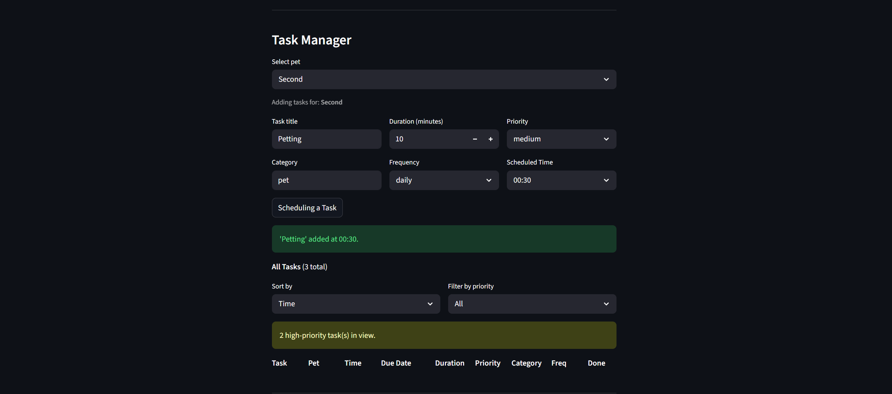
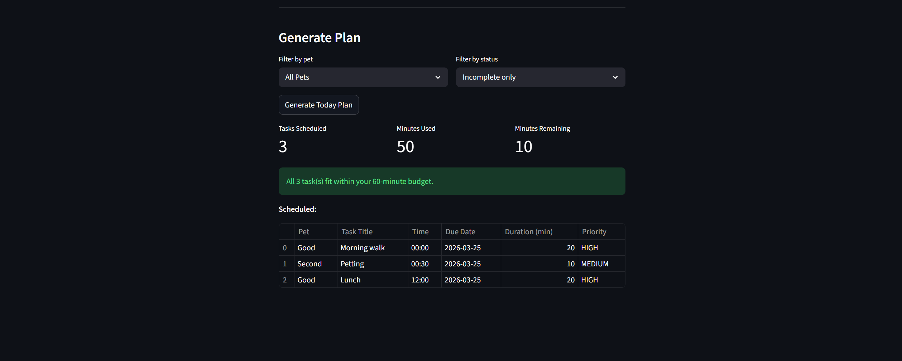
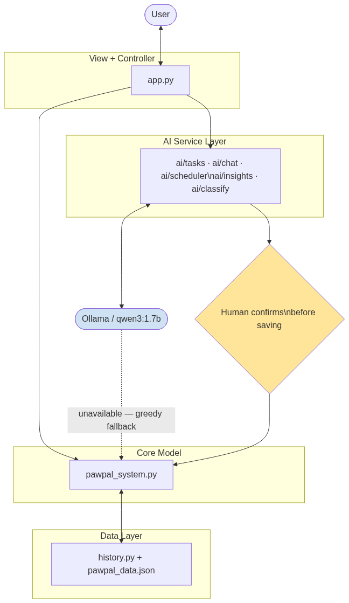
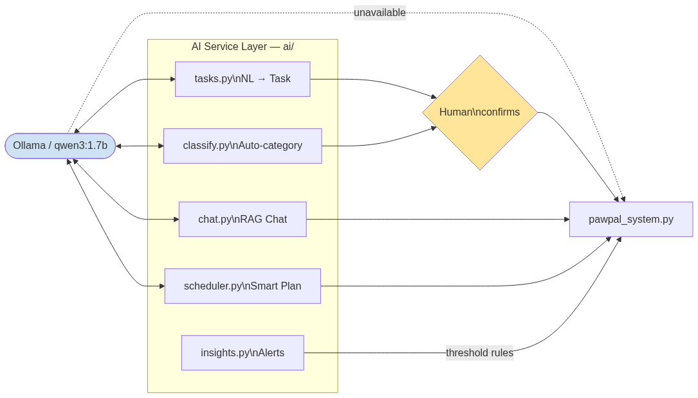
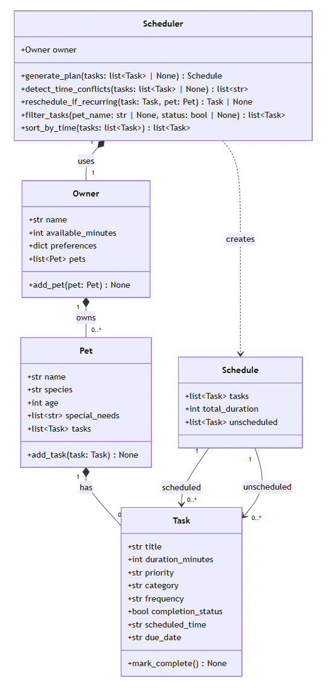

# PawPal+ (Module 2 Project)

PawPal+ is an AI-powered pet care assistant built with Python and Streamlit. It replaces decentralized UI forms with a **Unified Conversational Hub**, allowing pet owners to manage tasks across multiple pets using native natural language. It harnesses Dynamic Intent Routing and JSON sanitization for resilient actions. The AI layer runs entirely on a local Ollama model, such as `llama3.2:3b`, with no API key required.

## Features

- **Owner setup**: enter your name and daily time budget; fields lock after saving with an Edit button to unlock
- **Multi-pet support**: add any number of pets (name, species, age, and optional special needs); switch between pets to manage their tasks; each pet's special needs are summarized below the task table
- **Task manager**: add tasks with title, duration, priority, category, frequency, and scheduled time (15-minute step picker); tasks are only saved if no time conflict exists
- **Conflict detection**: warns before saving if another task is already scheduled at the same time slot across any pet
- **Sort and filter**: sort tasks by scheduled time, priority, or duration; filter by priority; high-priority badge shows count of outstanding items
- **Complete / uncomplete**: toggle completion per task with strikethrough display; completing a daily or weekly task automatically queues the next occurrence; uncompleting removes it
- **Generate Plan**: filter by pet and status, schedule incomplete tasks within the time budget, display Scheduled / Could not fit / Complete tables
- **Data persistence**: all data saves to `data/pawpal_data.json` automatically on every change; restored on refresh or restart

## AI Features
- **Unified Conversational Hub**: All actions occur through a primary native chat interface. A global setup menu provides rapid access to commands.
- **Dynamic Intent Routing**: The `router.py` parses user intent organically (e.g., Add Task vs Check Schedule) and routes it internally without requiring button clicks.
- **Robust Anti-Guessing Extraction**: Natural language extraction strictly avoids guessing required fields (e.g., time, valid pet names). If data is lacking, the AI proactively returns a conversational counter-prompt instead of throwing errors or guessing.
- **JSON Output Sanitization**: Integrated regex-based filtering strictly isolates python dictionaries from LLM conversational filler, ensuring resilient physical tooling.
- **RAG chat assistant**: Ask questions regarding your pet schedule and receive context-aware responses purely sourced from your local JSON data files.

## Demo

### 1. Owner & Pet Setup


### 2. Task Manager


### 3. Task List


### 4. Generate Plan


## Architecture Overview

PawPal+ uses a lightweight layered architecture wrapped smoothly around a Unified Conversational UI.



| Layer | File(s) | Responsibility |
|-------|---------|---------------|
| Configuration | `config.py` | Centralized system instructions and LLM properties (no `.env` needed) |
| View + Controller | `app.py` | Streamlit asynchronous streaming chat interface |
| AI Service Layer | `ai/router.py`, `ai/tools.py`, `ai/utils.py` | Intent parsing, tool interactions, and markdown sanitization |
| Core / Model | `pawpal_system.py` | Data model, scheduler, conflict detection, persistence |
| Data Layer | `history.py`, `data/pawpal_data.json` | JSON persistence, completion history, analytics |

The AI Service Layer gracefully restricts itself. When Ollama is disconnected, the system manages raw exceptions to prevent severe UI freezes.

### AI Service Layer



### UML Diagram



## Setup Instructions

```bash
python -m venv .venv
source .venv/bin/activate  # Windows: .venv\Scripts\activate
pip install -r requirements.txt
ollama pull llama3.2:3b
ollama serve
streamlit run app.py
```

AI features require Ollama to be running. The app works without it but NL task creation, chat, alerts, and smart scheduling will fall back to manual/greedy behavior.

## Sample Interactions

*Fill in after AI features are built. Include at least 2-3 real input/output examples.*

| Feature | User Input | AI Output |
|---------|-----------|-----------|
| NL Task Creation | | |
| Chat Assistant | | |
| Predictive Alert | | |

## Design Decisions

| Decision | Choice | Pro | Con |
|----------|--------|-----|-----|
| LLM provider | Ollama local with `llama3.2:3b` | Highly capable, zero data sprawl, extremely flexible | Slower inference hardware demands |
| Central Configuration | `config.py` overrides `.env` | Eliminates extra dependencies/keys | Adjusting core configurations touches runtime variables |
| Missing Data Logic | Conversational AI interception | Prevents guessing or hard error locks | Requires an additional round trip to LLM |
| JSON Sanitization | Regular Expression Strippers | Highly resilient to varied LLM boilerplate | Complex formatting anomalies may occasionally penetrate |
| Testing AI components | Mock Router responses | Fast, repeatable, removes Ollama from standard test runner checks | Cannot emulate pure hallucination boundaries |

## Testing Summary

*Fill in after running the full test suite.*

- **Automated tests**: 26 core tests passing (`pytest tests/test_pawpal.py`); X / Y router tests passing (`pytest tests/test_router.py`)
- **Conversational Missing Data Protocol**: AI successfully intercepts broken variables (like missing time) by delivering natural counter-prompts instead of injecting defaults.
- **JSON Extraction Guardrails**: Malformed formatting (wrapper boilerplate output) is correctly nullified via `utils.py` regex stripping capabilities.
- **Human evaluation**: Manually verified chat responses are correctly routed between Chat and Tools without cross-contamination. Output effectively renders inside the UI Stream.

*Summary: Central architectural tests passing. The system securely routes intentions and halts bad data requests interactively.*

## Reflection

### Limitations and biases

- The NL task parser is only as good as the prompt. Unusual phrasing or ambiguous times may produce wrong field values with high confidence scores.
- The predictive alert system flags patterns statistically. A pet that genuinely needs less grooming in winter may trigger false missed-task alerts.
- Historical data reflects past owner behavior. If the owner was inconsistent early on, the smart scheduler learns those bad habits.
- The system has no veterinary knowledge. It cannot determine whether a medication schedule is medically appropriate.

### Misuse and prevention

- Primary risk is over-reliance: owners may treat AI health alerts as medical advice rather than pattern notices.
- Mitigation: every Priority 4 alert includes *"This is a pattern notice, not medical advice. Consult your vet for health concerns."*

### What surprised you during testing

*Fill in with actual observations after testing.*

### Collaboration with AI

- **Helpful suggestion**: one instance where the AI's suggestion meaningfully improved your design
- **Flawed suggestion**: one instance where the AI's suggestion was wrong, overkill, or broke something, and what you did instead
