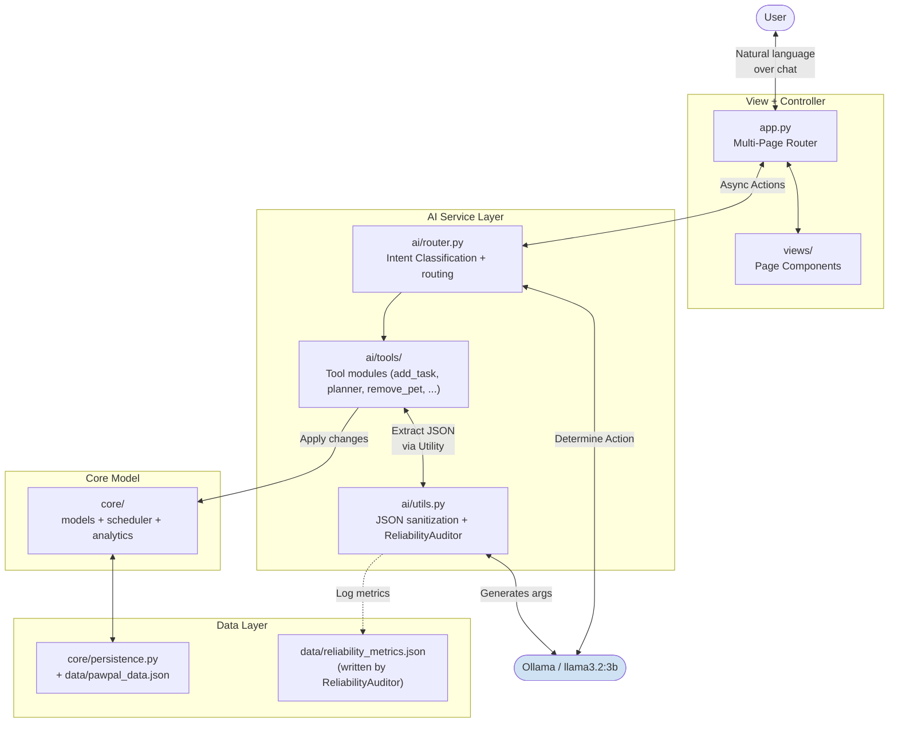
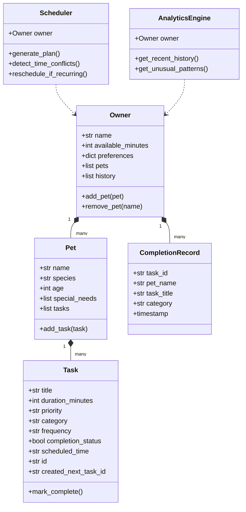
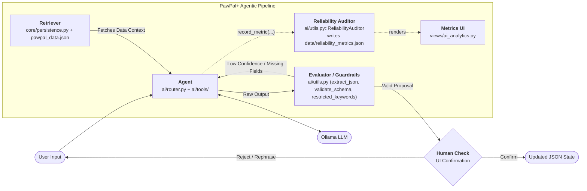

# PawPal+ (Module 2 Project)

PawPal+ is an AI-powered pet care assistant built with Python and Streamlit. It features a powerful **Hybrid UI**, maintaining standard dashboard controls while introducing a **Floating Conversational Hub**. This allows pet owners to manage tasks across multiple pets using native natural language at their convenience. It harnesses Dynamic Intent Routing and JSON sanitization for resilient actions. The AI layer runs entirely on a local Ollama model, such as `llama3.2:3b`, with no API key required.

## Features

- **Owner setup**: enter your name and daily time budget; fields lock after saving with an Edit button to unlock
- **Multi-pet support**: add any number of pets (name, species, age, and optional special needs) on the Dashboard; remove a pet via **Remove** then confirm or cancel on the Dashboard, or through the AI assistant with confirmation; switch between pets to manage their tasks; each pet's special needs are summarized below the task table
- **Task manager**: add tasks with title, duration, priority, category, frequency, and scheduled time (15-minute step picker); tasks are only saved if no time conflict exists
- **Conflict detection**: Warns during task creation if another task overlaps within the same duration window across any pet. Uses interval-based logic rather than simple time-string matching.
- **Sort and filter**: sort tasks by scheduled time, priority, or duration; filter by priority; high-priority badge shows count of outstanding items
- **Complete / uncomplete**: toggle completion per task using an **Interactive Checkbox** within the data table; completing a daily or weekly task automatically queues the next occurrence; uncompleting removes it
- **Generate Plan**: filter by pet and status, schedule incomplete tasks within the time budget, display Scheduled / Could not fit / Complete tables. Features **Fully Reactive Rendering** where the plan automatically updates and persists throughout the session.
- **Data persistence**: all data saves to `data/pawpal_data.json` automatically on every change; restored on refresh or restart. Includes hardened validation to prevent accidental overwrites with empty owner profiles during initialization.

## AI Features

| Feature | Category | Base Component | Extra Enhancement (+2) | Guardrails | Primary Files |
| :--- | :--- | :--- | :--- | :--- | :--- |
| **CRUD Pets** | RAG, Specialized Model | Adds, lists, or removes pets via natural language. | **Multiple Data Sources:** Reads the `pawpal_data.json` database dynamically before acting. | Mandatory human UI confirmation before any data deletion. | `ai/tools/add_pet.py`, `ai/tools/remove_pet.py` |
| **Check Plans** | RAG, Specialized Model | Reads the local database and returns today's schedule. | **Enhancement:** Formats raw JSON data dynamically into a grouped narrative. | Clean, null-safe fallback for empty schedules. | `ai/tools/schedule.py` |
| **Schedule a Task** | Specialized Model, Reliability System | Extracts title, duration, category, and scheduled time. | **Constrained Tone & Style:** Uses zero-temperature grounding (0.0) and rigid prompts to force pure JSON extraction instead of open chat. | Strict HH:MM time validation and `>0` duration enforcement. | `ai/tools/add_task.py` |
| **Smart Planner** | Agentic Workflow, RAG, Specialized Model | AI plans, acts, and verifies schedule creation using retrieved data. | **Multi-Step Reasoning:** Uses an observable 5-turn refinement loop, plus a dynamic 6th LLM fallback call for conversational constraints. | Enforces strict daily minute budgets and interval overlap prevention. | `ai/tools/planner.py` |
| **Check Status** | RAG, Specialized Model | Retrieves user history and missed tasks before answering. | **Multiple Data Sources:** Merges real-time anomalies from `AnalyticsEngine` with history. | Prohibits markdown lists to force a purely conversational tone. | `ai/tools/status.py` |
| **Automated Testing** | Reliability or Testing System | Tracks model performance and confidence scores. | **Evaluation Harness:** Tracks confidence and success rates in production and across 139 mocked Pytest scenarios. | Schema validation strictly prevents partial payloads from executing. | `ai/utils.py`, `tests/` |

*\* RAG = Retrieval-Augmented Generation*


## Demo

- **Loom Demo**: `https://www.loom.com/share/dd1285ab11214abd912afe854a911fcd`

## Architecture Overview

PawPal+ uses a lightweight layered architecture wrapped smoothly around a Unified Conversational UI.



| Layer | File(s) | Responsibility |
|-------|---------|---------------|
| Configuration | `config.py` | Centralized system instructions, pet care guidelines, and UI constants (emojis) |
| Layout Router | `app.py` | Streamlit entry point, `st.navigation` orchestration, and session state initialization |
| Page Components | `views/` package | Modular UI pages: Dashboard (Profile/Pets), Tasks, Planner, and AI Metrics |
| AI Service Layer | `ai/router.py`, `ai/tools/`, `ai/utils.py` | Intent parsing, zero-temperature grounding, tool interactions, and markdown sanitization |
| Core / Model | `core/` package (`models`, `scheduler`, `analytics`) | Data model, scheduler logic, and anomaly detection |
| Data Layer | `core/persistence.py`, `data/pawpal_data.json` | Automated JSON persistence and completion history |

The AI Service Layer gracefully restricts itself. When Ollama is disconnected, the system manages raw exceptions to prevent severe UI freezes.

### AI Service Layer


### UML Diagram



### System Organization

The system is designed as an agentic pipeline with automated validation and human-in-the-loop checkpoints.



| Component | Role | Logic |
|-----------|------|-------|
| **Retriever** | Data Fetching | Loads pet profiles, history, and schedule from `pawpal_data.json` into AI context. |
| **Agent** | Orchestration | Interprets intent and coordinates tool execution with the local LLM. |
| **Evaluator / Tester** | Self-Correction | Validates AI payloads for JSON integrity, scheduling conflicts, and care guidelines. |
| **Reliability Auditor** | **Evaluation & Metrics** | Quantifies AI performance by tracking confidence scores and multi-turn refinement efficiency. |
| **Human Check** | Decision Guard | Final verification step where the owner approves or rejects AI Proposals. |

## Setup Instructions

```bash
python -m venv .venv
source .venv/bin/activate  # Windows: .venv\Scripts\activate
pip install -r requirements.txt
ollama pull llama3.2:3b
ollama serve
streamlit run app.py
```

AI features require Ollama to be running. The app works without it but NL task creation, chat, alerts, and smart scheduling will fall back to manual/greedy behavior.

## Sample Interactions

| Feature | User Input | AI Output |
|---------|------------|-----------|
| **NL Task Creation** | "Schedule a 20min feeding for Mochi at 8am" | "Please verify this schedule: **Feeding** for **Mochi** at 08:00... Does this look accurate?" |
| **Manage Pets** | "Add a 2 year old cat named Snow" | "I've prepared the profile for **Snow**! ... Should I add them to your family?" |
| **List Pets** | "Which pets do I have?" | "Oh, I see that you have 2 dogs, **Pug** (1 year old) and **Mochi** (3 years old), and 1 cat, **Luna** (15 years old) with special needs of senior and arthritis..." |
| **Proactive Planner** | "What should I schedule?" | "Here is your smart plan: 10 task(s) for 3 pet(s)." grouped by pet with timeline (`08:00` - Morning Walk  30m) |
| **Packed Schedule** | "What should I schedule?" | "Your schedule is already packed for today! ... To add more tasks, please either mark some as 'Complete' or increase your daily time limit in the Dashboard." |
| **Unified Status Report** | "Check status" | "You've had a great start! Mochi completed feeding, but missed a walk. Let's get back on track by marking that complete." |
| **Escape Action** | "Nevermind" | *Breaks active intent lock and returns to main menu context.* |

## Design Decisions

| Decision | Choice | Pro | Con |
|----------|--------|-----|-----|
| LLM provider | Ollama local with `llama3.2:3b` | Free, runs offline, no API key, strong baseline capabilities | Slower inference, higher hallucination risk on a smaller model, requires stricter guardrails and confirmations |
| Central Configuration | `config.py` overrides `.env` | Eliminates extra dependencies/keys | Adjusting core configurations touches runtime variables |
| Missing Data Logic | Conversational AI interception | Prevents guessing or hard error locks | Requires an additional round trip to LLM |
| JSON Sanitization | Regular Expression Strippers | Highly resilient to varied LLM boilerplate | Complex formatting anomalies may occasionally penetrate |
| Schedule validation | Programmatic post-processing over prompt-only enforcement | Deterministic gap/budget/time checks regardless of LLM quality | Additional code complexity in validation loop |
| Testing AI components | Mock Router responses | Fast, repeatable, removes Ollama from standard test runner checks | Cannot emulate pure hallucination boundaries |

## Testing and Reliability

PawPal+ maintains a high-integrity, regression-proof codebase with **>95% test coverage** across all AI and core modules.

- **Mocked AI Layers**: All Ollama interactions are mocked for deterministic testing.
- **Reliability Auditing**: Automated tracking of AI confidence, turn counts, and extraction success.
- **Agentic Validation**: Multi-turn self-correction loops for complex scheduling tasks are fully verified.

### Running Tests
```bash
python -m pytest --cov=ai --cov=core --cov-report=term-missing tests
```

Current Suite: **139 Tests Passed**  

Overall Coverage: **98%** (`ai` + `core` with `pytest-cov`)

### Core System Tests
- **Data Integrity**: Verifies that task completion toggles correctly, pet additions scale properly, and primary keys (UUIDs) remain globally unique for accurate persistence.
- **Scheduling Logic**: Ensures budget-aware plan generation, interval-based conflict detection (identifying overlaps even between non-identical clock times), and idempotent recurrence (preventing duplicate tasks if completion is toggled multiple times).
- **Behavioral Analytics**: Validates anomaly detection for missed tasks, sliding-window history filters, and historical record removal upon "undoing" a completion.
- **Persistence Layer**: Confirms that the full state—including complex parent-child task linkages—survives JSON serialization and recovery across system restarts.

### AI Service Layer Tests
- **Intent Reliability**: Proves the system correctly routes diverse natural language queries to the proper internal tools, while maintaining strict context locks during multi-turn interactions and keyword-based escapes.
- **Agentic Refinement**: Verifies the 5-turn self-correction loop in the Smart Planner, including a dynamic 6th LLM call that synthesizes a positive, constraint-aware conversational fallback message if the schedule cannot be perfectly resolved.
- **Safety & Grounding**: Confirms that data-modifying actions (like removing a pet) trigger mandatory user-confirmation menus and that AI suggestions are strictly grounded in pet-specific care guidelines.
- **Payload Resiliency**: Tests the system's ability to extract structured data from "noisy" LLM output and handle malformed response formats using the hardened regex sanitizer.
- **Automated Validation**: Confirms that AI outputs are strictly checked against schemas and content guardrails (keyword scanning) before being processed by the application core.
- **Reliability Auditing**: Verifies the lifecycle of the `ReliabilityAuditor`, which quantifies system health by aggregating **Confidence Scores** (0.0 to 1.0) and success rates for the system evaluation dashboard.
- **Infrastructure**: Uses `unittest.mock` and a synchronized `SessionState` fixture in `conftest.py` to isolate tests from local Ollama and Streamlit states for deterministic execution. The `ReliabilityAuditor` limit test uses in-memory `json.load`/`json.dump` mocks to avoid 1,100 disk I/O cycles.
- **Documentation Standard**: All **139 test cases** feature standardized header documentation for improved auditability.

### System Capabilities Summary
- **Proactive Anomaly Detection**: `AnalyticsEngine` identifies missed recurring tasks and triggers conversational alerts.
- **Batch Plan Execution**: The AI assistant processes multiple pet requirements simultaneously and applies updates via batch confirmation.
- **Human Evaluation**: Manually verified that "Smart Plan" suggestions respect species guidelines and historical patterns.

*Summary: A total of **139 out of 139 tests** are passing. Coverage for `ai` and `core` is **98%** with the command above.*

## Reflection

See [`model_card.md`](model_card.md) for the full reflection and ethics write-up, including limitations and biases, misuse risks and mitigations, what surprised us during reliability testing, and helpful and flawed AI collaboration examples.
