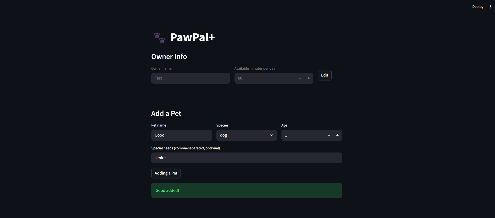

# PawPal+ (Module 2 Project)

You are building **PawPal+**, a Streamlit app that helps a pet owner plan care tasks for their pet.

## Scenario

A busy pet owner needs help staying consistent with pet care. They want an assistant that can:

- Track pet care tasks (walks, feeding, meds, enrichment, grooming, etc.)
- Consider constraints (time available, priority, owner preferences)
- Produce a daily plan and explain why it chose that plan

Your job is to design the system first (UML), then implement the logic in Python, then connect it to the Streamlit UI.

## What you will build

Your final app should:

- Let a user enter basic owner + pet info
- Let a user add/edit tasks (duration + priority at minimum)
- Generate a daily schedule/plan based on constraints and priorities
- Display the plan clearly (and ideally explain the reasoning)
- Include tests for the most important scheduling behaviors

## UML Diagram


## Features

- **Owner setup**: enter your name and daily time budget; fields lock after saving with an Edit button to unlock
- **Multi-pet support**: add any number of pets (name, species, age, and optional special needs); switch between pets to manage their tasks; each pet's special needs are summarized below the task table
- **Task manager**: add tasks with title, duration, priority, category, frequency, and scheduled time; tasks are only saved if no time conflict exists
- **Conflict detection**: warns before saving a task if another task is already scheduled at the same time slot across any pet
- **Sort and filter**: sort tasks by scheduled time, priority, or duration; filter by priority; high-priority badge shows count of outstanding items
- **Complete / uncomplete**: toggle completion per task with strikethrough display; completing a daily/weekly task automatically queues the next occurrence; uncompleting removes it
- **Generate Plan**: filter by pet, then generate a schedule from incomplete tasks only; shows tasks scheduled, minutes used, and minutes remaining; displays Scheduled, Could not fit, and Complete tables
- **Data persistence**: all owner, pet, and task data is saved to `data/pawpal_data.json` automatically on every change (add pet, add task, mark complete/incomplete, save owner); data is restored on page refresh or restart so nothing is lost

## Demo

### 1. Owner & Pet Setup


### 2. Task Manager


### 3. Task List


### 4. Generate Plan


## Getting started

### Setup

```bash
python -m venv .venv
source .venv/bin/activate  # Windows: .venv\Scripts\activate
pip install -r requirements.txt
```

## Smarter Scheduling

Four logic improvements were added to `pawpal_system.py` to make the scheduler more useful for a real pet owner.

### Sort tasks by time

`Scheduler.sort_by_time(tasks)` returns any list of tasks ordered chronologically by their `scheduled_time` field (`"HH:MM"` string). Because times are zero-padded, Python's built-in `sorted()` with a plain string lambda is enough — no datetime parsing needed.

```python
sorted_tasks = scheduler.sort_by_time(all_tasks)
```

Each `Task` has a `scheduled_time` field (default `"00:00"`), set in the app via a time picker with 15-minute increments, and a `due_date` field (`"YYYY-MM-DD"`, defaults to today) displayed in both the Task Manager and Generate Plan tables. The Generate Plan section calls `sort_by_time()` directly to order the scheduled table. The Task Manager sorts its tuple list inline since it works with `(pet, task)` pairs rather than plain tasks.

### Filter tasks by pet

`Scheduler.filter_tasks(pet_name=None, status=None)` returns a flat list of tasks matching the supplied filters:

```python
scheduler.filter_tasks(pet_name="Mochi")  # Mochi's tasks only
scheduler.filter_tasks(pet_name=None)     # all tasks across all pets
```

In the app, the Generate Plan section uses `filter_tasks(pet_name=..., status=...)` to scope tasks by pet and status (Incomplete only / Complete only / All tasks). `generate_plan()` is then called on the incomplete subset of those results.

### Recurring task handling

`Scheduler.reschedule_if_recurring(task, pet)` marks a task complete and, if its `frequency` is `"daily"` or `"weekly"`, creates the next occurrence with the correct due date using Python's `timedelta`:

```python
# daily:  next due = today + 1 day
# weekly: next due = today + 7 days
next_task = scheduler.reschedule_if_recurring(task, pet)
```

Each `Task` stores a `due_date` field (`"YYYY-MM-DD"`) that defaults to today. One-off tasks (`"once"`) return `None`, no new task is created. The next occurrence is stored in session state so that clicking "No" (uncomplete) can cleanly remove it from the pet's task list.

### Conflict detection

`Scheduler.detect_time_conflicts(tasks=None)` checks whether any two tasks share the same `scheduled_time` slot across all pets. It never raises — it returns a list of plain-text warning strings (empty list means no conflicts):

```python
conflicts = scheduler.detect_time_conflicts()
# ["CONFLICT at 09:00 — Litter box (Luna), Meds (Mochi)"]
```

In the app, this check runs before a new task is saved. If a conflict is found, the task is rejected with a warning and the owner is prompted to choose a different time.

### Challenge 2: Data Persistence with Agent Mode

All data is saved to `data/pawpal_data.json` and loaded back automatically. The `data/` folder is created on the first save if it does not exist.

Two functions in `pawpal_system.py` handle persistence so `app.py` stays UI-only:

- `save_data(owner)`: serializes the `Owner`, its `Pet` list, and each pet's `Task` list to JSON and writes it to disk
- `load_data()`: reads the file and reconstructs the full object graph; returns an empty `Owner` if the file does not exist yet

```python
# called once at startup (session state initialization)
st.session_state.owner = load_data()

# called after every mutation
save_data(owner)
```

The JSON structure mirrors the object hierarchy directly:

```json
{
  "name": "Alex",
  "available_minutes": 90,
  "pets": [
    {
      "name": "Mochi",
      "species": "cat",
      "tasks": [
        { "title": "Morning feed", "priority": "high", ... }
      ]
    }
  ]
}
```

---

### Suggested workflow

1. Read the scenario carefully and identify requirements and edge cases.
2. Draft a UML diagram (classes, attributes, methods, relationships).
3. Convert UML into Python class stubs (no logic yet).
4. Implement scheduling logic in small increments.
5. Add tests to verify key behaviors.
6. Connect your logic to the Streamlit UI in `app.py`.
7. Refine UML so it matches what you actually built.
