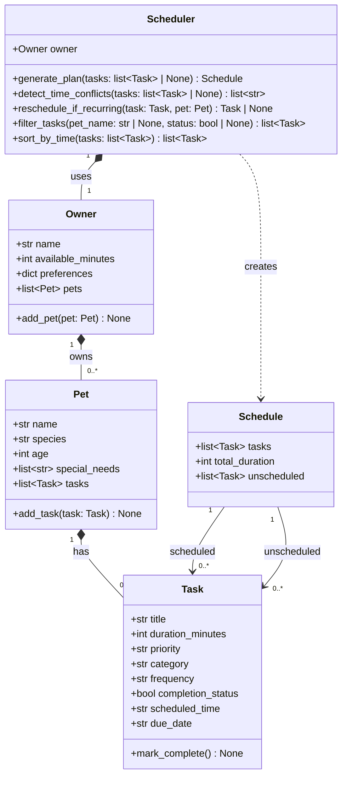

# PawPal+ Design Document

## UML Class Diagram



## Class Descriptions

### Owner
Represents the pet owner. Stores their name, daily time budget (`available_minutes`), optional preferences, and a list of pets they care for. `add_pet()` appends a new `Pet` to the list.

### Pet
Represents a pet. Stores the pet's name, species, age, special needs, and the list of care tasks associated with that pet. `add_task()` appends a new `Task` to the pet's task list.

### Task
A single care activity. Has a title, duration, priority (`"low"`, `"medium"`, or `"high"`), category, frequency (`"daily"`, `"weekly"`, or `"once"`), and completion status. Also stores `scheduled_time` as an `"HH:MM"` string and `due_date` as a `"YYYY-MM-DD"` string (defaults to today). `mark_complete()` sets `completion_status` to `True`.

### Schedule
The output of planning. Contains tasks that fit within the owner's time budget (`tasks`), tasks that could not be scheduled (`unscheduled`), and the total duration of all scheduled tasks.

### Scheduler
The core engine. Takes an `Owner` and operates on tasks across all their pets.

- `generate_plan(tasks)`: Accepts an optional pre-filtered task list (defaults to all tasks across all pets). Sorts by priority (high first) with duration as a tiebreaker, then greedily fits tasks within `available_minutes`. Returns a `Schedule`.
- `detect_time_conflicts(tasks)`: Checks for tasks sharing the same `scheduled_time` slot. Returns a list of warning strings (one per conflicting slot), or an empty list when there are none.
- `reschedule_if_recurring(task, pet)`: Marks a task complete and creates the next occurrence using `timedelta` (`"daily"` adds 1 day, `"weekly"` adds 7 days). Returns the new `Task`, or `None` for non-recurring frequencies.
- `filter_tasks(pet_name, status)`: Returns a flat list of tasks filtered by pet name and/or completion status. Pass `None` for either argument to skip that filter.
- `sort_by_time(tasks)`: Returns a new list sorted chronologically by `scheduled_time` (lexicographic sort on zero-padded `"HH:MM"` strings).

Priority strings are converted to integers for sorting using a module-level mapping:

```python
PRIORITY_ORDER = {"low": 1, "medium": 2, "high": 3}
```

## Core User Actions

The app exposes these actions a user must be able to perform:

| # | Action | Where | What it does |
|---|---|---|---|
| 1 | **Set up owner** | Main area — Owner Info | Inputs for owner name and available minutes per day; fields lock after the name is set, with an Edit button to unlock; stored in session state as an `Owner` object |
| 2 | **Add a pet** | Main area — Add a Pet | Inputs for pet name, species (dog / cat / other), age, and special needs (comma-separated, optional); creates a `Pet` and calls `owner.add_pet()`; sets it as the active pet |
| 3 | **Add a task** | Main area — Task Manager | Form inputs for title, duration, priority, category, frequency, and scheduled time (15-minute step picker); `detect_time_conflicts()` is called before committing — task is only added if there are no conflicts; `due_date` defaults to today |
| 4 | **Sort and filter tasks** | Main area — Task Manager | Sort by scheduled time / priority (high first) / duration (shortest first); filter by priority; a badge shows the count of high-priority tasks in the current view; task rows display: Task, Pet, Time, Due Date, Duration, Priority, Category, Freq; each pet's special needs are listed below the table |
| 5 | **Complete / uncomplete a task** | Main area — Task Manager task row | Per-row toggle button ("Yes" / "No"); completed tasks display with strikethrough; clicking "Yes" calls `reschedule_if_recurring()` — for daily/weekly tasks the next occurrence is created and stored in session state; clicking "No" reverts completion and removes the next occurrence |
| 6 | **Generate Plan** | Main area — Generate Plan | Filter tasks by pet (all or one) and by status (Incomplete only / Complete only / All tasks); `generate_plan()` is called on the incomplete subset of the filtered results; displays three metrics (tasks scheduled, minutes used, minutes remaining) and three tables: Scheduled (sorted by time), Could not fit, and Complete |

---

## Relationship Summary

| Relationship | Type | Description |
|---|---|---|
| Owner -> Pet | Composition | An owner manages one or more pets |
| Pet -> Task | Composition | A pet owns its care tasks |
| Scheduler -> Owner | Composition | The scheduler is configured for a specific owner |
| Scheduler -> Schedule | Dependency | `generate_plan()` creates and returns a new Schedule instance |
| Schedule -> Task | Association | A schedule references tasks from the pets' task lists |
